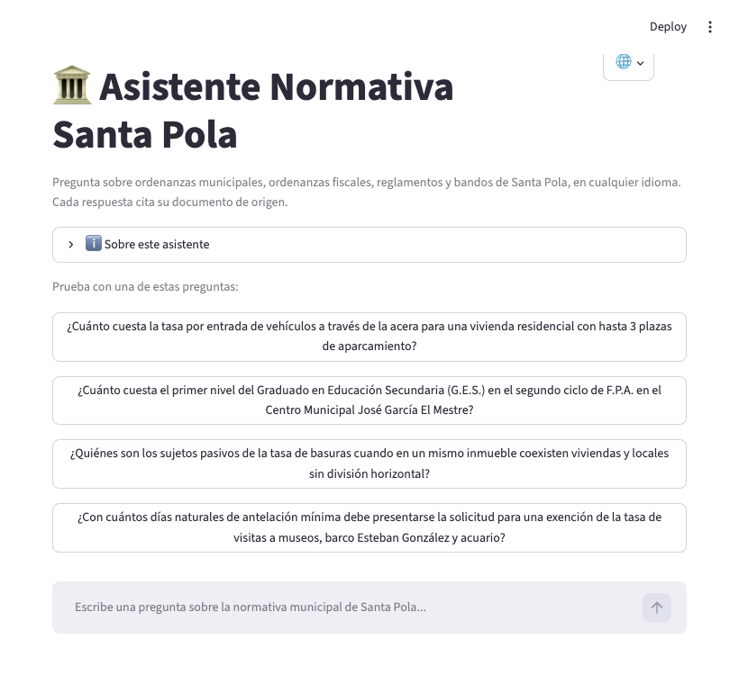
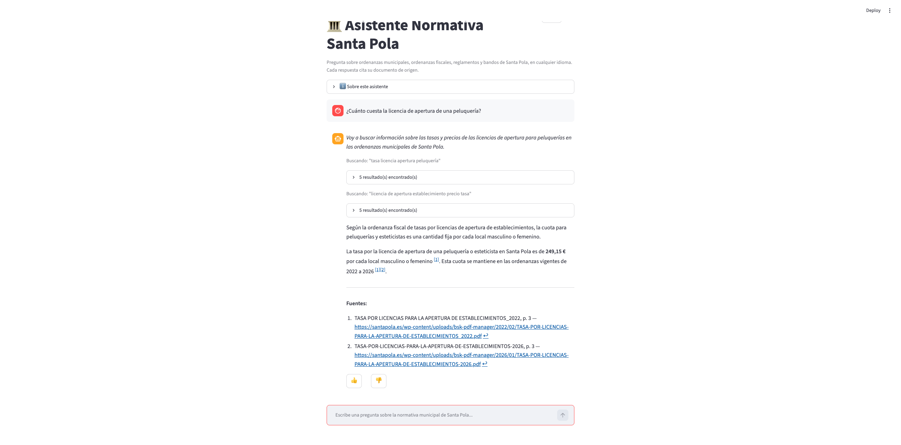
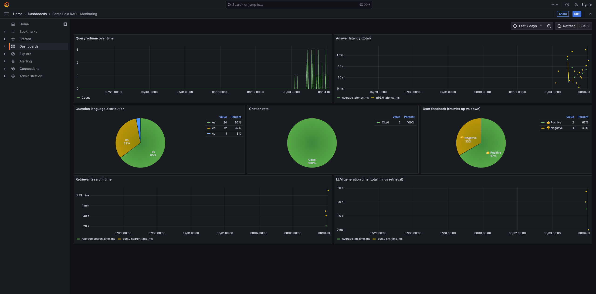
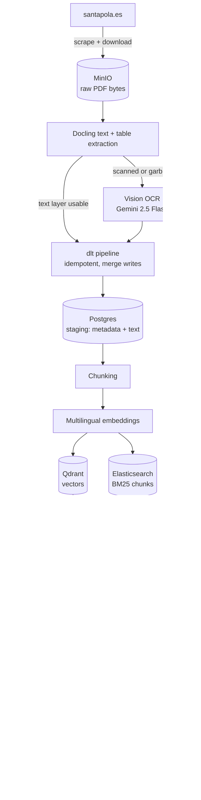

# Santa Pola Municipal Ordinances Assistant

This is a multilingual, conversational RAG assistant over the public municipal ordinances, tax ordinances, bylaws and public notices ("bandos") of Santa Pola, Spain, built as the capstone project for the [LLM Zoomcamp 2026](https://github.com/DataTalksClub/llm-zoomcamp) course.

Residents of Santa Pola come from dozens of countries, and the official source documents are only published in Spanish. This assistant lets anyone ask "How much is the dog census fee?" or "Quand puis-je installer une terrasse sur la voie publique ?" in their own language and get an answer grounded in, and cited from, the actual ordinance.

**Live demo:** [santa-pola-normativa-assistant.streamlit.app](https://santa-pola-normativa-assistant.streamlit.app/), running on Streamlit Community Cloud against Qdrant Cloud and Elastic Cloud. **Live monitoring:** [public Grafana dashboard](https://beigegopher1006.grafana.net/public-dashboards/30eeddd150c54dcf891a08063d25123c), backed by the same Elastic Cloud indices and by traces exported to Grafana Cloud Tempo.

<p align="center">
  
  
  
</p>

## Problem

Santa Pola's town hall publishes ~1,470 PDFs across 22 sections of [santapola.es/ayuntamiento](https://santapola.es/ayuntamiento/). Finding the right fee, deadline or rule means knowing which of dozens of PDFs to open, in Spanish, often in a scanned/non-searchable format. This project builds a real ingestion pipeline over four "hard regulation" categories (269 PDFs), the ones residents and small businesses actually need to cite, and a conversational assistant that always answers with a source citation (document, page, URL), never from memory alone.

## Dataset

Scraped live from santapola.es, not the course FAQ:

| Category | Slug | PDFs |
|---|---|---|
| Ordenanzas Fiscales (tax ordinances) | `ordenanzas-fiscales` | 182 |
| Reglamentos y otras Ordenanzas (bylaws) | `reglamentos-otras-ordenanzas` | 54 |
| Bandos (public notices) | `bandos` | 23 |
| Normativas (regulations) | `normativas` | 10 |
| **Total** | | **269** |

269 PDFs produce 2,815 pages (242 of them scanned/image-only and OCR'd) and 9,904 indexed chunks. The category list (`santa_pola_rag/ingestion/scraper.py`) is a plain dict of slug to name, so extending to any of the other 18 sections on the town hall's site is a one-line change. Both the PDF and page count drift slightly over time since the site is scraped live, not from a frozen dataset.

## Architecture



Tempo is Grafana's own trace storage backend: every agent run is exported to it via OpenTelemetry, and Grafana queries it to show the full request waterfall (agent, LLM calls, tool execution, hybrid search).

## Why these choices

- Ingestion runs as a real, automated pipeline. `dlt` resources and transformers scrape the listing pages, download PDFs, extract text, and fall back to vision OCR page by page. Every run commits one category at a time to Postgres, so a late failure never loses already-completed (and already-paid) work, and pages already staged are skipped on re-runs unless `--force` is passed: OCR is a paid call, so losing the PDF cache should never mean silently re-paying for it.
- PDFs are content-addressed objects in MinIO. `boto3` writes and reads them against a local S3-compatible bucket; `extract.py` reads bytes straight from memory (Docling's `DocumentStream` over a `BytesIO`) with no temp files. Any machine pointed at the same MinIO instance sees the same PDFs.
- Text extraction is table-aware, not just character-aware. `PyMuPDF`'s plain `page.get_text("text")` reads a page in raw left-to-right, top-to-bottom order, so a tariff table's category labels and its euro amounts end up on opposite sides of the page in the extracted text, sometimes separated by hundreds of characters. `docling` parses the page layout and exports a real Markdown table instead, keeping each label on the same row as its actual figure. This was a real, measured fix, not a hypothetical one: see "Evaluation > Retrieval" below.
- Scanned pages and technical diagrams go through vision OCR. They're rendered to an image and sent to `google/gemini-2.5-flash` via OpenRouter, with the document's title and category injected into the prompt for context. Testing against a real evacuation diagram found it accurate but still occasionally wrong on fine print, which is exactly why every answer must cite its source page.
- Embeddings are multilingual. `sentence-transformers/paraphrase-multilingual-MiniLM-L12-v2` gives ~0.85 cosine similarity between semantically equivalent Spanish/English/French sentences at design time, and in production an English question about "Saint John's night" correctly retrieves the Spanish "Noche de San Juan" bando as the top hit.
- Retrieval combines vector search, keyword search and reranking. Qdrant (HNSW) and Elasticsearch (BM25, Spanish analyzer) are queried in parallel and fused with Reciprocal Rank Fusion, then the fused candidates are rescored by a multilingual cross-encoder (`cross-encoder/mmarco-mMiniLMv2-L12-H384-v1`, `search/reranker.py`) that reads the actual query and passage text jointly instead of only combining two rank positions. Measured impact is in "Evaluation > Retrieval" below.
- The agent rewrites the user's question into its own search queries. The system prompt requires `search_ordinances` queries to be phrased in Spanish regardless of what language the user asked in, and lets the agent issue several purpose-built queries per question (for example, "¿Cuánto cuesta la licencia de apertura de una peluquería?" becomes queries like `licencia apertura peluquería tasa precio` and `tasa licencia apertura establecimientos actividades`) rather than a single verbatim lookup against the index.
- Elasticsearch handles keyword search. It serves concurrent reads and writes for a real multi-user app, with the built-in Spanish analyzer stemming ordinance text for better BM25 recall.
- Pydantic AI drives the agent. Typed tool calling, structured judge output and native OpenTelemetry instrumentation come with comparatively little boilerplate.
- Every agent run is traced end-to-end, from the agent through LLM calls, tool execution and hybrid search, exported via OTLP to Tempo. Every question, answer and feedback vote is also indexed into its own Elasticsearch index (`santa_pola_queries`/`santa_pola_feedback`, separate from the chunk index) with latency, detected language and citation presence, feeding the Grafana dashboard. This keeps each service to one clear job: Postgres stages ingestion text, Elasticsearch handles search and logs, Qdrant handles vectors, MinIO holds raw files.
- Every claim is cited. The agent cites with a numbered inline marker (`[1]`) and lists each distinct source once at the end in a fixed `[n] <title>, p. <page>, <url>` format; `rag/citations.py` turns that into deduplicated, bidirectionally-linked footnotes, recomputing numbers from the actual (title, page, url) rather than trusting the model's own numbering, since testing vision OCR against a real technical diagram found a genuine transcription error (120 vs 140 people in an evacuation sector) that makes an uncited hallucination risk unacceptable for a municipal-services assistant.
- The interface is multilingual independently of the conversation. The chat answers in whatever language a question is asked in, detected with `lingua-language-detector`, since `langdetect` proved empirically non-deterministic and consistently wrong on some real short questions from this app. The UI chrome (title, placeholders, buttons) is a separate choice, picked from a compact popover selector and stored per-language in `app/locales/*.toml`, since Streamlit has no built-in i18n API of its own.
- A hard cap limits searches per question, enforced in code. The agent gets a fixed budget of `search_ordinances` calls (`MAX_SEARCHES_PER_TURN` in `rag/agent.py`); once exhausted, the tool returns a message telling it to answer with what it already has instead of one more real Qdrant+Elasticsearch round trip. A prompt asking the model to "search efficiently" is a request, not a guarantee, so the limit is a boundary check on the tool call itself.

## Real issues found and fixed during ingestion

Running the full 268-PDF ingestion surfaced three real bugs no amount of code review would have caught:

- Extraction concurrency deadlocked deterministically. dlt's default 5-way extraction concurrency reliably stalled (near-zero CPU, no progress) whenever two large scanned PDFs were OCR'd at the same time, always at the same page across repeated runs, even though the same page OCR'd in isolation succeeded in 4 seconds. The root cause isn't fully isolated (likely an OpenRouter-side or connection-pool concurrency limit rather than a client bug); pinning `EXTRACT__WORKERS=1` so OCR calls never overlap avoids shipping a pipeline that can silently hang for hours on paid API calls.
- One scanned page triggered unbounded degenerate generation. `google/gemini-2.5-flash` fell into a repetition loop that generated over 1,000,000 characters in a single response, the actual cause of what first looked like the same "hang." `max_tokens=2048` on the OCR call plus a defense-in-depth truncation (`MAX_DESCRIPTION_CHARS`) logs a warning and caps the stored text if a response still comes back abnormally long.
- Some PDFs' text layer was silently corrupted. They embed subset fonts with a broken ToUnicode map, so PyMuPDF "extracts" text that is 60%+ control characters, not real content. A control-character-ratio check (`ingestion/extract.py`) routes those pages to OCR instead of indexing garbage.

## Running it

**Prerequisites:** Docker and Docker Compose. A DeepSeek API key (chat) and an OpenRouter API key (vision OCR for scanned pages).

```bash
cp .env.example .env   # fill in DEEPSEEK_API_KEY and OPENROUTER_API_KEY
docker compose up -d
```

That single command brings up every dependency (Postgres, Qdrant, Elasticsearch, MinIO, Tempo, Grafana), runs the full ingestion and indexing pipeline once, and then starts the Streamlit app on `:8501`. The first run scrapes and OCRs real documents, so it takes a while and makes real OpenRouter API calls; watch its progress with:

```bash
docker compose logs -f ingest
```

The pipeline is idempotent, so re-running `docker compose up -d` later does not repeat completed work. To force a full re-download/re-OCR, or to limit a run to specific categories, override the ingest service's command directly:

```bash
docker compose run --rm ingest uv run python -m santa_pola_rag.ingestion.pipeline --force
docker compose run --rm ingest uv run python -m santa_pola_rag.ingestion.pipeline --categories bandos,normativas
```

For local iteration on the app's own code without rebuilding the image each time, `uv sync` followed by `uv run streamlit run src/santa_pola_rag/app/streamlit_app.py` runs it directly on the host against the same docker-compose dependencies.

Grafana dashboard: http://localhost:3000/d/santa-pola-rag (anonymous access enabled for local use). MinIO console: http://localhost:9001.

### Cloud deployment

The live demo above runs the same codebase with every backend swapped for a managed equivalent:

- [Qdrant Cloud](https://cloud.qdrant.io/) for vectors and [Elastic Cloud](https://www.elastic.co/cloud) for BM25 search and the query/feedback logs, both reindexed from the same staged text with no re-scraping or re-OCR needed. `config.py` accepts an optional `QDRANT_API_KEY`/`ELASTICSEARCH_API_KEY` for exactly this case; against a local, unauthenticated Postgres/Qdrant/Elasticsearch stack, both stay unset.
- The Streamlit app itself deploys straight from this GitHub repo on [Streamlit Community Cloud](https://streamlit.io/cloud), which reads dependencies from `uv.lock` natively. Docling (and the torch/transformers/opencv stack that comes with it) lives in an `ingestion` extra rather than the base dependencies for exactly this: the app never imports it, and Streamlit Cloud's plain `uv sync` skips extras by default, so the deployed app doesn't carry that whole dependency tree just to serve chat.
- Traces go to Grafana Cloud's Tempo over the same OTLP exporter, authenticated with an `OTEL_EXPORTER_OTLP_HEADERS` value in the standard `key=value` format (e.g. `Authorization=Basic <base64(instanceID:apiToken)>`); against the local, unauthenticated Tempo in `docker-compose.yml`, it stays unset.
- [Neon](https://neon.tech/) (serverless Postgres) and [Cloudflare R2](https://developers.cloudflare.com/r2/) (S3-compatible storage) replace the local Postgres/MinIO for a fully cloud-native ingestion path, runnable from GitHub Actions instead of `docker-compose.yml`: see `.github/workflows/ingest.yml`. `config.py`'s `postgres_sslmode` (Neon requires `require`) and `minio_region` (R2 requires `auto`) exist for this.

## Evaluation

### Retrieval

30 ground-truth questions generated by an LLM from randomly sampled chunks (mixed Spanish/English/French/German/Valencian, matching the assistant's real user base), evaluated at k=5 against the full 9,904-chunk corpus:

| Strategy | Hit rate | MRR |
|---|---|---|
| Vector only (Qdrant) | 30.0% | 0.171 |
| Text only (Elasticsearch BM25) | 40.0% | 0.247 |
| Hybrid (RRF), no reranking | 36.7% | 0.236 |
| **Hybrid (RRF) + cross-encoder reranking** | **60.0%** | **0.457** |

BM25 still outperforms embeddings alone on this corpus: hundreds of tax ordinances share near-identical boilerplate paragraphs (a chunk about "TASA POR X" is semantically close to dozens of other "TASA POR Y" chunks), which confuses a general-purpose multilingual encoder more than it confuses exact-term lexical matching. Plain RRF fusion still lands *below* BM25 alone (36.7% vs 40.0%) rather than between the two, for the same reason: a chunk that merely appears in the vector channel's noisy top-50 can outrank a chunk BM25 ranked highly but the vector channel missed entirely. Reranking the top 20 RRF-fused candidates with a multilingual cross-encoder fixes this, since it scores the actual query against the actual candidate text jointly instead of only combining two rank positions, and roughly doubles the hit rate over either channel alone. This configuration is kept as the default because it is also the only one with a real retrieval path for non-Spanish questions (an English question about "Saint John's night" only succeeds through the vector channel; BM25 alone returns nothing relevant for it), which this 30-question aggregate, dominated by same-language matches, doesn't fully capture.

Two extraction/chunking fixes drove the jump from an earlier 30.0%/0.186 baseline to the numbers above, both traced to the same real user question ("how much will I pay to get my towed car back") going unanswered:

1. Chunk size was widened from 800 to 1,200 characters (overlap from 150 to 200): the vehicle-impound ordinance's tariff table was splitting with the category labels in one chunk and the euro amounts in the next, and the amounts-only chunk carried so little lexical or semantic signal on its own that neither search channel ever surfaced it, not even in the top 50 raw candidates before fusion or reranking.
2. PDF text extraction moved from `PyMuPDF`'s plain `page.get_text("text")` to `docling`, which parses table layout into real Markdown tables instead of a left-to-right character stream. Even with the wider chunk size, a table's labels and figures could still land far apart in a flat text stream; keeping each row intact fixed that at the source and raised every metric above again, including vector-only hit rate (16.7% with the chunk-size fix alone, 30.0% with both fixes), since a properly laid-out table also gives the multilingual encoder a cleaner unit of meaning to embed.

These are real, un-cherry-picked evaluation results, not target numbers; `eval/retrieval_results.json` has the raw output. Regenerate with `uv run python scripts/generate_ground_truth.py && uv run python scripts/evaluate_retrieval.py`.

### Answer quality (LLM-as-judge)

`google/gemini-2.5-flash` (a different model and provider than the answer-generating `deepseek-chat`, to avoid self-preference bias) scores each answer on relevance, faithfulness, and citation presence against the context the agent actually retrieved, reasoning step by step before a pass/fail verdict (`evaluation/llm_judge.py`). On the full 30-question ground truth, against the current pipeline: **29/30 passed**. Full transcript in `eval/rag_judge_results.json`; regenerate with `uv run python scripts/evaluate_rag.py`.

The one "failure" is the agent correctly declining an out-of-scope question (an EU regulation, not a Santa Pola ordinance) rather than a real quality gap; the judge scores a scope refusal as not relevant/cited, which is the expected shape for a correct refusal, not evidence of a bug (the same refusal behavior is exercised deliberately in "Prompt hardening" below). This score is also considerably higher than raw retrieval hit rate (60.0% at k=5) would suggest, and for a real reason, not an evaluation quirk: the agent always phrases its own `search_ordinances` queries in Spanish regardless of the question's language, so the multilingual questions that a standalone `hybrid_search(question)` call misses are frequently still answered correctly once the agent's own Spanish query rewriting is in the loop. An earlier version of this evaluation built the judge's context from a fresh `hybrid_search(item.question)` call instead of the context the agent's tool calls actually returned, which reproduced that same cross-lingual miss inside the judge itself and understated the score (8/10 on the first 10 questions) for that reason rather than a real answer-quality problem.

### Output format compliance (prompt and temperature comparison)

A second, separate quality dimension is whether the model follows the output-format rules in the system prompt (the exact citation-list layout, going straight to the final answer with no draft recap) regardless of whether the answer's *content* is correct. Two concrete failure patterns were reproduced and measured on the same real question, run 6 times per configuration:

| Configuration | HTML wrapping (bug) | Duplicated recap paragraph (bug) |
|---|---|---|
| Default temperature, no examples | ~1 in 6-7 | ~2-3 in 6 |
| Temperature 0.3 + one positive example | 0 in 6 | 1 in 6 |
| + one explicit negative (wrong-vs-right) example | 0 in 6 | 0 in 6 |

The best configuration (lower temperature, positive and negative few-shot examples) is what's deployed in `rag/agent.py`. It reduces the failure rate rather than guaranteeing it away, since LLM instruction-following is probabilistic: as defense in depth, `rag/citations.py` also strips any HTML the model still adds, and recomputes citation numbers from the actual (title, page, url) rather than trusting the model's own numbering.

## Monitoring

The Grafana dashboard (`monitoring/grafana/dashboards/santa_pola_rag.json`) reads live from Elasticsearch and Tempo:

1. Query volume over time
2. Answer latency, total (avg / p95)
3. Question language distribution
4. Citation rate
5. User feedback (👍/👎)
6. Retrieval (search) time (avg / p95): how much of the total latency is spent in `hybrid_search`
7. LLM generation time (avg / p95): the remainder, covering narration, tool-call construction and the final answer

Every agent run is also traced end-to-end (agent, LLM calls, tool execution, hybrid search, Qdrant/Elasticsearch) via OpenTelemetry to Tempo, browsable from the same Grafana instance. The [public dashboard](https://beigegopher1006.grafana.net/public-dashboards/30eeddd150c54dcf891a08063d25123c) is the same layout reading from Elastic Cloud instead, fed by the live demo above.

## Prompt hardening

The system prompt restricts the agent to Santa Pola's ordinances, tells it to treat both user messages and search_ordinances results as data rather than instructions, and refuses to reveal itself even when asked to translate, roleplay past, or "hypothetically" bypass the rule. It held up against 12 adversarial prompts across two rounds (direct override, system-prompt extraction, DAN-style roleplay, off-topic requests, fabricate-a-citation, drop-the-citation-requirement, and softened or nested variants of each), including one case where the agent ignored an explicit "skip the citation for this one" request and cited its source anyway. This is evidence from one test pass with a fixed set of prompts, not a security guarantee: LLM instruction-following stays probabilistic, and indirect injection via the indexed documents themselves, as opposed to the user's message, hasn't been tested, since all indexed content currently comes from the town hall's own site rather than user-supplied documents.

## Limitations and future work

- Retrieval hit rate, even after reranking (60.0% hybrid @k=5), still has real, measured room to grow, driven by hundreds of near-duplicate tax-ordinance chunks: a chunk about "TASA POR X 2024" is lexically and semantically close to the near-identical "TASA POR X 2025" and "...2026" chunks, and the recency bonus in `search/hybrid.py` only nudges ties, it doesn't resolve genuine ambiguity about which year's figure the question is actually asking about. Dense, list-heavy tariff tables used to be a second, compounding problem on top of that: a table split across a chunk boundary, or laid out as bare digits once PyMuPDF's linear text extraction separated a row's label from its own figure, was the root cause of a real 49-tool-call runaway loop for one such question before `MAX_SEARCHES_PER_TURN` was added, and of a real user's thumbs-down after the search budget ran out with the figures still unfound. Both failure modes are fixed now (see "Retrieval" above: wider chunking keeps small tables intact, and `docling`'s table-aware extraction keeps each row's label next to its own figure); the near-duplicate-years problem above is the one that remains open. In practice this raw retrieval number understates real answer quality, since the agent's own Spanish query rewriting recovers most of what a standalone search with the question's original wording misses (see "Answer quality" above, 29/30), but it is still the ceiling on how well a single search call can do on the first try, before the agent gets a chance to rephrase.
- A structured LLM output (a typed schema instead of free text) would remove the citation-formatting failure class in "Output format compliance" by construction, but needs a way to stream a structured field's text live without exposing the underlying JSON deltas to the chat UI, which the current streaming setup doesn't yet do.
- Only 4 of santapola.es's 22 document categories are ingested; adding more is a one-line change to `CATEGORIES` in `scraper.py`.
- MCP server exposing the agent to Claude Desktop and similar clients: a natural next step once the above is in place.

## Evaluation criteria, where covered

| Criterion | Where |
|---|---|
| Problem description | [Problem](#problem) |
| Retrieval flow (knowledge base + LLM) | [Architecture](#architecture); the agent's `search_ordinances` tool in `rag/agent.py` |
| Retrieval evaluation (multiple approaches) | [Evaluation > Retrieval](#retrieval): vector-only, text-only and hybrid with reranking, compared with real numbers |
| LLM evaluation (multiple approaches) | [Evaluation > Answer quality](#answer-quality-llm-as-judge) and [Evaluation > Output format compliance](#output-format-compliance-prompt-and-temperature-comparison) |
| Interface | [Running it](#running-it); Streamlit chat UI |
| Ingestion pipeline (automated) | [Why these choices](#why-these-choices); `dlt` pipeline |
| Monitoring (feedback + dashboard) | [Monitoring](#monitoring): 👍/👎 feedback plus a 7-panel Grafana dashboard |
| Containerization | [Running it](#running-it): everything in `docker-compose.yml`, including the app itself |
| Reproducibility | [Running it](#running-it); `uv.lock` pins every dependency version |
| Best practice: hybrid search | [Why these choices](#why-these-choices), [Evaluation > Retrieval](#retrieval) |
| Best practice: document re-ranking | [Evaluation > Retrieval](#retrieval): cross-encoder reranking of the RRF-fused candidates |
| Best practice: query rewriting | [Why these choices](#why-these-choices): the agent phrases its own search queries, it never searches the raw question |
| Bonus: cloud deployment | [Cloud deployment](#cloud-deployment); [live demo](https://santa-pola-normativa-assistant.streamlit.app/) |
