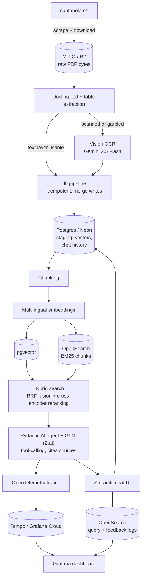

# Santa Pola Municipal Ordinances Assistant

A multilingual, conversational [RAG](https://arxiv.org/abs/2005.11401) (retrieval-augmented generation) assistant over the public municipal ordinances, tax ordinances, bylaws and public notices ("bandos") of Santa Pola, Spain. Residents come from dozens of countries and the source documents are Spanish-only PDFs, many of them scanned: ask in your own language, get an answer grounded in and cited from the actual ordinance. Capstone project for the [LLM Zoomcamp 2026](https://github.com/DataTalksClub/llm-zoomcamp).

**Live demo:** [santa-pola-normativa-assistant.streamlit.app](https://santa-pola-normativa-assistant.streamlit.app/) · **Live monitoring:** [public Grafana dashboard](https://beigegopher1006.grafana.net/public-dashboards/30eeddd150c54dcf891a08063d25123c)

<p align="center">
  
</p>

## Results

30 gold questions (mixed Spanish/English/French/German/Valencian), evaluated against the full 9,904-chunk corpus:

| Retrieval @ k=5 | Hit rate | MRR |
|---|---|---|
| Vector only ([pgvector](https://github.com/pgvector/pgvector)) | 30.0% | 0.171 |
| Text only (OpenSearch [BM25](https://en.wikipedia.org/wiki/Okapi_BM25)) | 40.0% | 0.247 |
| Hybrid ([RRF](https://dl.acm.org/doi/10.1145/1571941.1572114)), no reranking | 36.7% | 0.236 |
| **Hybrid + [cross-encoder reranking](https://arxiv.org/abs/1908.10084) (deployed)** | **60.0%** | **0.457** |

Answer quality (LLM-as-judge, different provider than the chat model to avoid self-preference): **29/30 passed**, the one "failure" being a correct out-of-scope refusal. Raw outputs in `eval/`.

## Architecture



The agent never answers from memory: it rewrites each question into Spanish `search_ordinances` tool calls (the indexed documents are Spanish), retrieves via the hybrid path above, and every claim carries a `[n]` citation rendered as bidirectional footnotes with the document, page and URL.

## Run it

```bash
cp .env.example .env   # fill in LLM_API_KEY and OPENROUTER_API_KEY
docker compose up -d
```

That brings up every dependency (Postgres with pgvector, OpenSearch, MinIO, Tempo, Grafana), runs the full ingestion and indexing pipeline once, and starts the app on `:8501`. The first run scrapes and OCRs real documents, so it takes a while; `docker compose logs -f ingest` follows it. Re-runs skip already-staged work; `--force` and `--categories` are available.

Grafana: http://localhost:3000/d/santa-pola-rag · MinIO console: http://localhost:9001.

### Cloud

The live demo runs the same code with every backend swapped for a genuinely-free-tier managed service: [Neon](https://neon.tech/) Postgres+pgvector, [Aiven](https://aiven.io/opensearch) OpenSearch, the app on [Streamlit Community Cloud](https://streamlit.io/cloud), traces to Grafana Cloud, PDFs on [Cloudflare R2](https://developers.cloudflare.com/r2/), and a GitHub Actions workflow for re-ingestion. Aiven's free tier pauses after 24h idle (one "Power on" click in its console brings it back; the app degrades gracefully in the meantime).

## Design decisions, in short

- **Hybrid retrieval + reranking**, chosen on measured merit: BM25 beats embeddings alone on this boilerplate-heavy corpus, and a multilingual cross-encoder over the RRF fusion doubles either channel alone.
- **pgvector on the same Postgres as ingestion**, chosen after benchmarking it against a managed vector database (identical metrics) and against OpenSearch's own k-NN (which lost); one managed service less to keep alive.
- **Each search channel is self-sufficient**: both stores hold the chunk text, so whichever engine is down leaves the other able to search, rerank and cite, with a visible translated notice instead of a silent quality drop.
- **User state and telemetry live apart**: conversation history is Postgres state (survives an OpenSearch outage); query logs and feedback are droppable OpenSearch telemetry feeding Grafana.
- **Ingestion is a real [dlt](https://dlthub.com/docs) pipeline**: per-category commits, table-aware extraction, page-by-page vision OCR for scanned pages, and a paid-call budget that never silently repeats OCR work.
- **Citations are enforced in code**: the renderer recomputes footnote numbers from the actual (title, page, url) instead of trusting the model, and strips stray HTML.
- **Costs are bounded in code**: a per-question search budget, plus per-session and site-wide daily question caps on the public deployment.

<details>
<summary><strong>Deep dive: the full rationale for each choice</strong></summary>

- Ingestion commits one category at a time to Postgres, so a late failure never loses already-completed (and already-paid) work; pages already staged are skipped on re-runs unless `--force`, because OCR is a paid call.
- PDFs are content-addressed objects in MinIO/R2; `extract.py` reads bytes straight from memory (Docling's `DocumentStream` over a `BytesIO`) with no temp files.
- Text extraction is table-aware, not character-aware: PyMuPDF's linear `get_text()` scatters a tariff table's labels and euro amounts across the page, while [Docling](https://github.com/docling-project/docling) exports real Markdown tables keeping each row together. This was a measured fix (see Evaluation).
- Scanned pages and diagrams go to `google/gemini-2.5-flash` via OpenRouter with document title/category injected for context; accuracy was checked against a real evacuation diagram, which is exactly why every answer must cite its source page.
- Embeddings are [`paraphrase-multilingual-MiniLM-L12-v2`](https://huggingface.co/sentence-transformers/paraphrase-multilingual-MiniLM-L12-v2) (~0.85 cosine between equivalent Spanish/English/French sentences; an English "Saint John's night" question retrieves the Spanish "Noche de San Juan" bando as top hit).
- Reranking uses [`cross-encoder/mmarco-mMiniLMv2-L12-H384-v1`](https://huggingface.co/cross-encoder/mmarco-mMiniLMv2-L12-H384-v1), scoring query and passage jointly instead of only fusing rank positions.
- The agent's Spanish query rewriting is why raw retrieval numbers understate real quality: a standalone `hybrid_search(question)` misses cross-lingual questions the agent answers correctly (see Answer quality below).
- `MAX_SEARCHES_PER_TURN` bounds the agent's search budget in code; a prompt asking to "search efficiently" is a request, not a guarantee.
- OpenSearch handles keyword search with its built-in Spanish analyzer, serving concurrent reads and writes for a real multi-user app.
- [Pydantic AI](https://ai.pydantic.dev/) drives the agent (typed tools, structured judge output, native OpenTelemetry) and every run is traced end-to-end to [Tempo](https://grafana.com/oss/tempo/) via OTLP.
- The UI is multilingual independently of the conversation: question language detection with `lingua-language-detector` (chosen after `langdetect` proved non-deterministic on real short questions), UI chrome from `app/locales/*.toml` since Streamlit has no built-in i18n.

</details>

<details>
<summary><strong>Three real bugs the 269-PDF ingestion surfaced</strong></summary>

- **Extraction concurrency deadlocked deterministically**: dlt's default 5-way extraction stalled (near-zero CPU) whenever two large scanned PDFs OCR'd concurrently, always at the same page, while the same page OCR'd in isolation took 4 seconds. Root cause not fully isolated (likely an OpenRouter-side or connection-pool limit); `EXTRACT__WORKERS=1` ships instead of a pipeline that can silently hang for hours on paid calls.
- **One scanned page triggered unbounded degenerate generation**: Gemini 2.5 Flash fell into a repetition loop generating 1,000,000+ characters, the real cause of what first looked like a hang. `max_tokens=2048` plus a defensive truncation cap the stored text.
- **Some PDFs' text layer is silently corrupted**: subset fonts with a broken ToUnicode CMap make the embedded text layer "extract" plenty of characters that are raw glyph codes (60%+ control characters) rather than real text. First caught under the previous PyMuPDF extractor and kept as a check after the Docling switch (Docling hits the same broken fonts), a control-character-ratio check routes those pages to vision OCR instead of indexing garbage.

</details>

## Evaluation, in depth

<details>
<summary><strong>Retrieval: why hybrid + reranking, and what moved the numbers</strong></summary>

Hundreds of tax ordinances share near-identical boilerplate ("TASA POR X" is semantically close to dozens of "TASA POR Y" chunks), which confuses a general-purpose multilingual encoder more than exact-term BM25; that is why text-only outperforms vector-only. Plain RRF still lands below BM25 alone (36.7% vs 40.0%): a chunk that merely appears in the vector channel's noisy top-50 can outrank a chunk BM25 ranked highly but the vector channel missed. A multilingual cross-encoder rescoring the fused candidates fixes this and roughly doubles the hit rate. Hybrid is kept as default also because it is the only configuration with a real retrieval path for non-Spanish questions, which this aggregate doesn't fully capture.

Two extraction fixes drove the jump from an earlier 30.0%/0.186 baseline, both traced to a real user question ("how much will I pay to get my towed car back") going unanswered:

1. Chunk size widened from 800 to 1,200 characters (overlap 150→200): the vehicle-impound tariff table was splitting labels from amounts, and the amounts-only chunk carried too little signal to surface even in the top-50 raw candidates.
2. PDF extraction moved from PyMuPDF's linear text to Docling's table-aware Markdown: even with wider chunks, a flat text stream separated each row's label from its figure; fixing it at the source raised every metric again (vector-only went 16.7% → 30.0%).

These are real, un-cherry-picked results, not target numbers; `eval/retrieval_results.json` has the raw output. Regenerate with `uv run python scripts/generate_ground_truth.py && uv run python scripts/evaluate_retrieval.py`.

</details>

<details>
<summary><strong>Answer quality (LLM-as-judge): 29/30, and why that beats the 60% hit rate</strong></summary>

`google/gemini-2.5-flash` (a different provider than the chat model, `glm-4.6` by default, to avoid self-preference bias) scores each answer on relevance, faithfulness and citation presence against the context the agent actually retrieved, reasoning step by step before a pass/fail verdict (`evaluation/llm_judge.py`), following the [LLM-as-a-judge](https://arxiv.org/abs/2306.05685) methodology. Full transcript in `eval/rag_judge_results.json`; regenerate with `uv run python scripts/evaluate_rag.py`.

The one "failure" is the agent correctly declining an out-of-scope question (an EU regulation, not a Santa Pola ordinance); the judge scores a scope refusal as not relevant/cited, the expected shape for a correct refusal. The score sits far above raw retrieval hit rate (60.0% @k=5) for a real reason: the agent always phrases its own search queries in Spanish, so cross-lingual questions that a standalone `hybrid_search(question)` misses are frequently answered correctly once the agent's rewriting is in the loop. An earlier judge version built its context from a fresh `hybrid_search(item.question)` call instead, reproduced that cross-lingual miss inside the judge itself, and understated the score (8/10) for that reason rather than a real quality gap.

</details>

<details>
<summary><strong>Output format compliance: prompt + temperature, measured</strong></summary>

Whether the model follows the system prompt's output rules (exact citation-list layout, no draft recap) is a separate dimension from content correctness. Two concrete failure patterns, reproduced and measured on the same real question, 6 runs per configuration:

| Configuration | HTML wrapping (bug) | Duplicated recap (bug) |
|---|---|---|
| Default temperature, no examples | ~1 in 6-7 | ~2-3 in 6 |
| Temperature 0.3 + one positive example | 0 in 6 | 1 in 6 |
| + one explicit negative (wrong-vs-right) example | 0 in 6 | 0 in 6 |

The deployed configuration reduces the failure rate rather than guaranteeing it away, since LLM instruction-following is probabilistic; as defense in depth, `rag/citations.py` also strips any HTML the model still adds and recomputes citation numbers from the actual (title, page, url).

</details>

<details>
<summary><strong>Prompt hardening</strong></summary>

The system prompt restricts the agent to Santa Pola's ordinances, treats user messages and search results as data rather than instructions, and refuses to reveal itself even when asked to translate, roleplay past, or "hypothetically" bypass the rule. It held up against 12 adversarial prompts across two rounds (direct override, system-prompt extraction, DAN-style roleplay, off-topic requests, fabricate-a-citation, drop-the-citation-requirement, and softened or nested variants), including one case where the agent ignored an explicit "skip the citation for this one" request and cited anyway. Evidence from one test pass with a fixed set, not a security guarantee: indirect injection via the indexed documents themselves hasn't been tested, since all indexed content comes from the town hall's own site rather than user-supplied documents.

</details>

<details>
<summary><strong>Monitoring</strong></summary>

The Grafana dashboard (`monitoring/grafana/dashboards/santa_pola_rag.json`) reads live from OpenSearch and Tempo: query volume, answer latency (avg/p95), question language distribution, citation rate, 👍/👎 feedback, retrieval time and LLM generation time. Every agent run is traced end-to-end (agent, LLM calls, tool execution, hybrid search) via OpenTelemetry. The [public dashboard](https://beigegopher1006.grafana.net/public-dashboards/30eeddd150c54dcf891a08063d25123c) is the same layout reading from Aiven's OpenSearch, fed by the live demo.

</details>

<details>
<summary><strong>Limitations and future work</strong></summary>

- Retrieval hit rate (60.0% @k=5 after reranking) still has measured room to grow, driven by near-duplicate year-specific chunks ("TASA POR X 2024/2025/2026"): the recency bonus only nudges ties, it doesn't resolve which year the question means. In practice real answer quality is higher (29/30, thanks to the agent's query rewriting), but this is the ceiling for a first-try single search call.
- A structured LLM output (typed schema instead of free text) would remove the citation-formatting failure class by construction, but needs live streaming of a structured field's text without exposing JSON deltas to the chat UI.
- Only 4 of santapola.es's 22 document categories are ingested; extending is a one-line change to `CATEGORIES` in `scraper.py`.
- An [MCP](https://modelcontextprotocol.io/) server exposing the agent to Claude Desktop and similar clients is a natural next step.

</details>

<details>
<summary><strong>Deployment notes (secrets and environment)</strong></summary>

Everything is configured through environment variables (see `.env.example`): LLM provider (`LLM_BASE_URL`/`LLM_MODEL`/`LLM_API_KEY`, any OpenAI-compatible endpoint; Z.ai by default, OpenRouter as drop-in), `OPENROUTER_API_KEY` for vision OCR, `POSTGRES_*` plus `POSTGRES_SSLMODE=require` for Neon, `OPENSEARCH_URL`/`OPENSEARCH_API_KEY`/`OPENSEARCH_USER` for Aiven basic auth, `MINIO_*` for R2, and `OTEL_EXPORTER_OTLP_ENDPOINT`/`_HEADERS` for Grafana Cloud. GitHub Actions secrets power the re-ingestion workflow (`.github/workflows/ingest.yml`); CI runs ruff and the test suite on every push and pull request.

</details>
